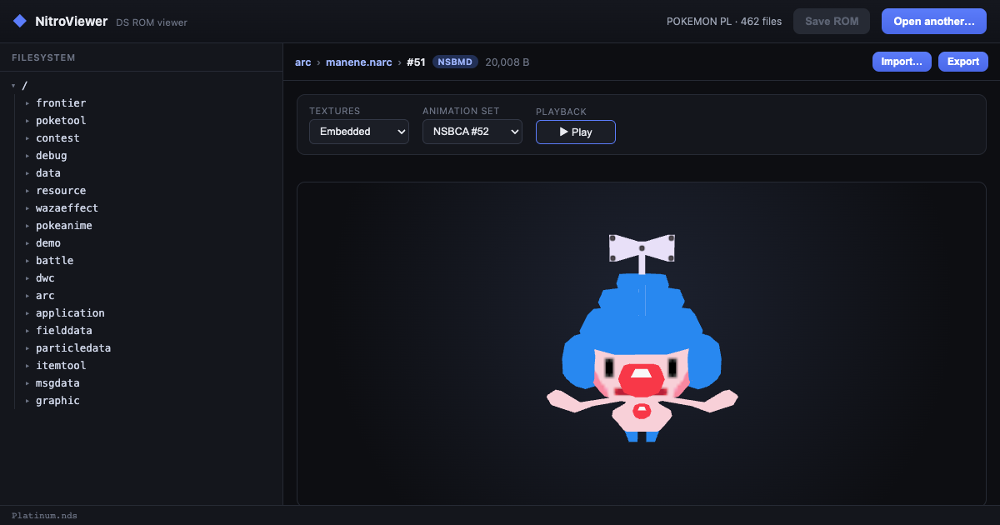

NitroViewer
===========

**NitroViewer** is a modern viewer and editor for Nintendo DS ROMs &mdash; a web replacement for
[Tinke](https://github.com/pleonex/tinke). Open a `.nds`, browse its filesystem, and
view or edit its graphics and 3D models. Nothing is uploaded; everything runs on your device.

Live at **[nitroviewer.com](https://nitroviewer.com)**.

> Powered by [Nds4j](https://github.com/turtleisaac/Nds4j).

What it does
------------

* **Browse** a ROM's filesystem and its NARC archives, with full-path navigation.
* **2D graphics** &mdash; NCGR sprites, NCLR palettes, NSCR tilemaps, NCER cells and NANR animations,
  with palette pairing, sub-palette selection, LZ decompression and PNG export.
* **3D &amp; effects** &mdash; NSBMD models + NSBTX textures, NSBCA skeletal and
  NSBMA / NSBVA / NSBTP animations, and SPA particles; orbit/zoom, glTF export and PNG capture.
* **Sound** &mdash; browse an SDAT, play SSEQ / SWAV / STRM, view an SSEQ as a note track, and import
  a WAV over a wave.
* **Edit &amp; save** &mdash; replace any file, or import a PNG over a sprite, then download the
  modified `.nds`.

License
-------

GPLv3 (see [LICENSE](LICENSE)), matching Nds4j.
